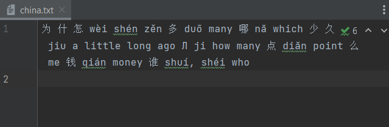
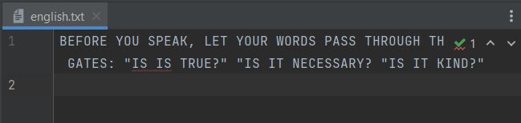
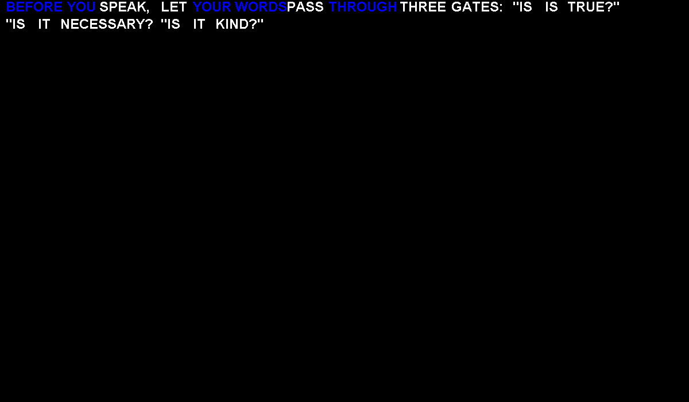
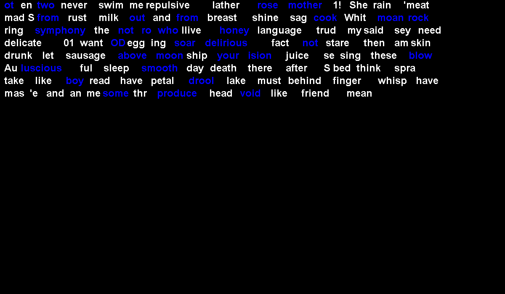

# OCR App

Brief : \
Step1: Write Java code to\
a: Upload the attached images to gDrive\
b: Write a program to extract all text from the images (both English and Chinese)\
c: Create two separately output files - one for English, one for Chinese (any format)\
d: In the output, colour code the English words in Blue font for all the colours with the
alphabet 'o' in it\
e: Take screenshot of the output files\
Step 2: upload the code and screenshots in Github

Implementation :\
a. Upload app can found at Upload.Java file\
b-d. Ocr app can found at App.java file\
e. the result is seperate by text and image\
&nbsp;&nbsp;&nbsp;- .txt file (chine.txt & english.txt)\
&nbsp;&nbsp;&nbsp;-  image file (result.png)\

\
Result Text

\
\
Result Image
\

